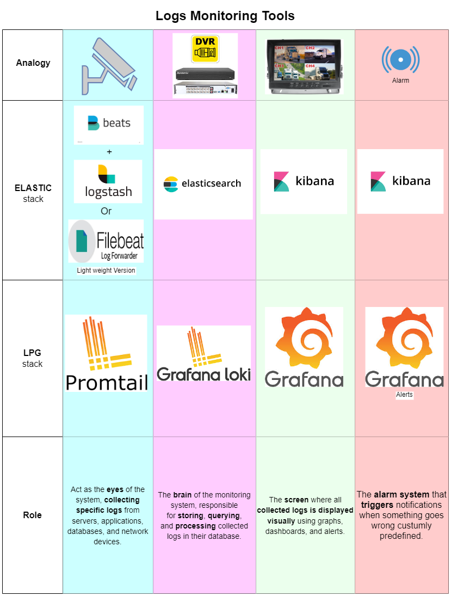
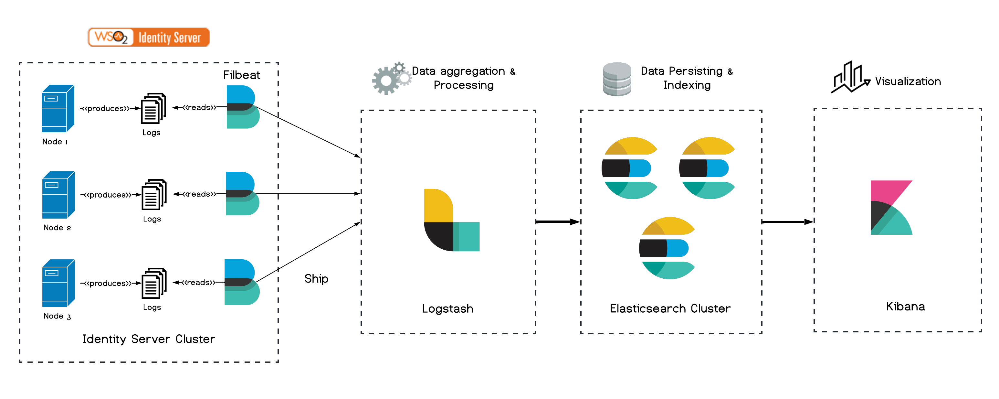
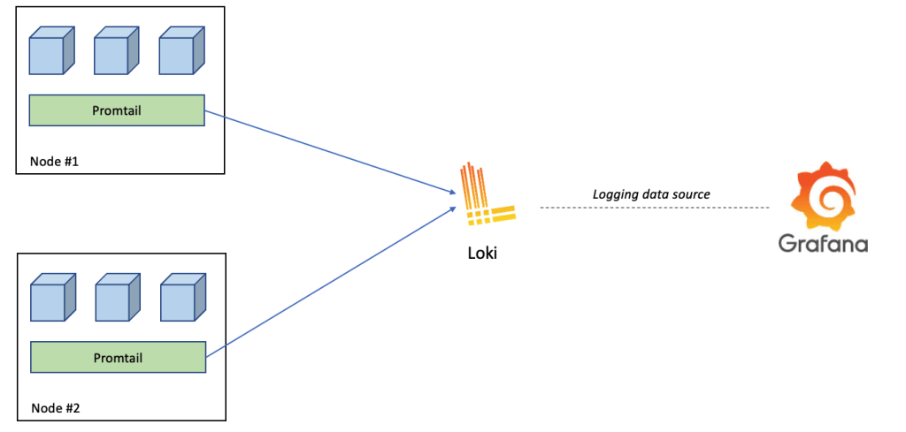

# Log analytics choice

- [Home](README.md)
- [Metrics](metrics/ReadMe.md)

## Analogy:

## Comparison ELK vs LPG

This document provides a detailed comparison between **ELK (Elasticsearch, Logstash, Kibana)** and **PLG (Loki, Promtail, Grafana)** stacks for log management and observability.

| Feature | ELK (Elasticsearch, Logstash, Kibana) | PLG (Loki, Promtail, Grafana) |
|---------|--------------------------------------|------------------------------------|
| **Data Storage** | ✔ Full-text indexed logs | ✘ Logs stored as compressed chunks, labels indexed |
| **Storage Mechanism** | ✔ Uses shards, indexes, and inverted indices | ✘ Uses object storage or local disk for log chunks, no indexing of raw log content |
| **Search Capabilities** | ✔ Full-text search, regex, analytics | ✘ Label-based filtering, limited search |
| **Query Language** | ✔ Elasticsearch Query DSL, KQL | ✘ LogQL (limited filtering) |
| **Scalability** | ✘ Resource-intensive | ✔ Highly scalable, minimal resource usage |
| **Resource Usage** | ✘ High CPU, memory, and disk I/O | ✔ Low resource usage |
| **Data Ingestion** | ✔ Flexible ingestion: Logstash, Beats, Fluentd | ✘ Limited to Promtail, Fluentd |
| **Pipeline Processing** | ✔ Advanced transformations, filtering, enrichment | ✘ Limited transformations |
| **Visualization** | ✔ Kibana: Advanced dashboards, ML insights | ✘ Grafana: Basic log visualization |
| **Alerting** | ✔ Built-in Watcher, AlertManager | ✘ Grafana alerting (less powerful) |
| **Log Format** | ✔ Supports structured/unstructured logs | ✘ Best for structured logs with labels |
| **Retention & Storage Costs** | ✘ Expensive at scale | ✔ Cost-efficient chunk-based storage |
| **Deployment Complexity** | ✘ Complex, requires tuning | ✔ Simple deployment |
| **Security & Access Control** | ✔ RBAC, TLS, API authentication | ✘ Basic authentication, evolving RBAC |
| **Multi-Tenancy** | ✔ Fully supported | ✘ Limited multi-tenancy |
| **Metrics Integration** | ✘ Can ingest metrics but not optimized | ✔ Native integration with Prometheus |
| **SIEM (Security Monitoring)** | ✔ Fully supported in Elastic Security | ✘ Not designed for SIEM |
| **Backup & Restore** | ✘ Complex backup strategies | ✔ Simple backup via object storage |
| **Cost & Licensing** | ✘ Expensive, commercial licensing | ✔ Free, open-source Loki |

## Summary
- **ELK is best for:** Advanced log analytics, full-text search, security monitoring (SIEM), and large-scale environments requiring deep log insights.
- **PLG is best for:** Lightweight log aggregation, low-cost operations, Kubernetes-native environments, and scalable cloud-native logging solutions.

---
## Architecture & Workflow
### ELK Stack Architecture
- **Elasticsearch** stores logs as indexed documents for fast search and analysis.
- **Logstash** ingests, processes, and enriches log data before sending it to Elasticsearch.
- **Kibana** provides powerful visualizations, dashboards, and query interfaces.

---
### PLG Stack Architecture
- **Loki** stores logs as compressed chunks, reducing resource overhead.
- **Promtail** collects logs from local sources and pushes them to Loki.
- **Grafana** visualizes logs with basic filtering and integrates with Prometheus metrics.

---

## Resource Requirements (Single-Machine Setup, No High Availability)

> Considered Application Stack & Retention Policy
>- **Odoo Instance**: 1 instance with 2 databases
>- **PostgreSQL Database**: 1 instance hosting 2 databases
>- **Reverse Proxy**: 1 Nginx + 1 Node.js custom proxy
>- **User Activity**:
>  - **Backoffice Usage**: 8-9 hours per day
>  - **End-User Access**: 12 hours per day (checking balance, refunds, etc.)
>- **Log Retention**: 60 days

| Resource | ELK Stack | PLG Stack |
|----------|----------|----------|
| **CPU** | 8-12 vCPUs | 4-6 vCPUs |
| **RAM** | 32GB+ (Elasticsearch requires high memory) | 8-12GB (Loki is lightweight) |
| **Disk Space** | 1TB SSD+ (Indexed logs consume high storage) | 500GB SSD (Compressed chunks are efficient) |
| **Bandwidth Usage** | High (Logstash and Elasticsearch require frequent communication) | Low to Moderate (Loki stores logs as chunks, reducing transmission overhead) |

---

## Resource Requirements for High-Availability ELK Setup

| Resource | Minimum Requirements |
|----------|---------------------|
| **Master Nodes (3x)** | 4 vCPUs, 8GB RAM each |
| **Data Nodes (3x)** | 8-16 vCPUs, 32GB+ RAM each |
| **Logstash Nodes (2x)** | 4 vCPUs, 8GB RAM each |
| **Kibana Node (1x)** | 2 vCPUs, 4GB RAM |
| **Storage** | 3TB SSD+ (distributed across data nodes) |
| **Bandwidth Usage** | Very High (Frequent inter-node communication and log indexing) |

---

## Considered Application Stack & Retention Policy
- **Odoo Instance**: 1 instance with 2 databases
- **PostgreSQL Database**: 1 instance hosting 2 databases
- **Reverse Proxy**: 1 Nginx + 1 Node.js custom proxy
- **User Activity**:
  - **Backoffice Usage**: 8-9 hours per day
  - **End-User Access**: 12 hours per day (checking balance, refunds, etc.)
- **Log Retention**: 60 days

---

## Why Choose One Over the Other?
### When to Choose ELK
- Need **advanced full-text search** capabilities.
- Require **log transformation and enrichment** before indexing.
- Running **security-focused monitoring** (SIEM use cases).
- Have a **dedicated infrastructure team** to manage tuning and scaling.

### When to Choose PLG
- Looking for a **lightweight, scalable log aggregation** solution.
- Primarily working with **Prometheus metrics and Kubernetes-native environments**.
- Need **cost-effective logging** without expensive licensing.
- Require **simple, efficient log storage with minimal indexing**.

## Final Decision
For enterprises requiring **full-featured log analytics**, ELK is the best option. However, for **cost-effective, scalable log collection** in cloud-native environments, **PLG is the superior choice** due to its efficient storage and integration with Prometheus.

---

- [Home](README.md)
- [Metrics](metrics/ReadMe.md)

