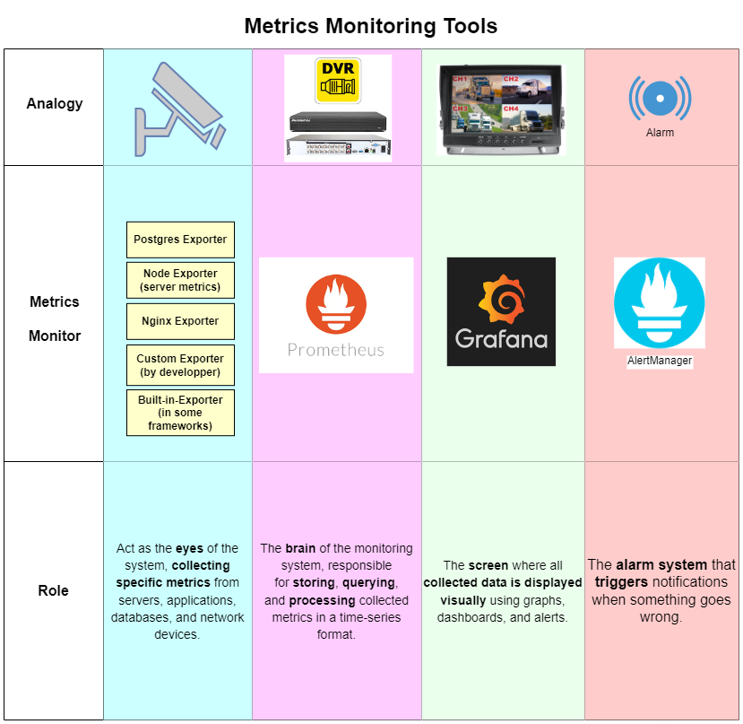

# Prometheus vs Zabbix vs Netdata Comparison

- [Home](/README.md)
- [Metrics - Tools](/metrics/ReadMe.md)
- [Logs - Tools](/logs/ReadMe.md)

---
**Technolog Chosen**: `Prometheus`.
 
This document provides a detailed comparison between **Prometheus**, **Zabbix**, and **Netdata**, three popular open-source monitoring solutions.
 

## Brief Comparison
| Feature | Prometheus | Zabbix | Netdata |
|---------|-----------|--------|---------|
| **Data Collection** | ✔ Pull-based (Prometheus scrapes targets) | ✘ Push-based (agents send data to server) | ✔ Real-time push-based, lightweight agents |
| **Metric Storage** | ✔ Time-series database optimized for high cardinality | ✘ Relational database (less scalable) | ✔ High-speed storage, optimized for real-time |
| **Query Language** | ✔ PromQL (powerful, flexible) | ✘ SQL-based, less optimized for time-series | ✘ Limited querying capabilities |
| **Alerting** | ✔ Built-in Alertmanager | ✔ Advanced alerting built-in | ✘ Basic alerting, limited rules |
| **Visualization** | ✔ Grafana integration | ✔ Zabbix UI (built-in dashboards) | ✔ Real-time web UI |
| **Scalability** | ✔ Highly scalable (federation, sharding) | ✘ Scaling is difficult | ✔ Scalable, lightweight |
| **Data Retention** | ✔ Configurable retention, long-term storage options | ✘ Relational DB limits long-term retention | ✔ Auto-managed retention, real-time data focus |
| **Resource Usage** | ✔ Efficient, low resource footprint | ✘ High CPU/memory for large environments | ✔ Minimal resource usage |
| **Ease of Setup** | ✘ Requires manual configuration | ✔ Easy setup with auto-discovery | ✔ Plug-and-play, instant monitoring |
| **Extensibility** | ✔ Extensive integrations, exporters | ✔ Many built-in templates | ✘ Fewer integrations available |
| **Security** | ✘ Authentication and RBAC require extra setup | ✔ Built-in security features | ✘ Limited security controls |
| **Best For** | Cloud-native, microservices, Kubernetes monitoring | Enterprise IT monitoring, SNMP, Windows/Linux systems | Real-time monitoring, lightweight deployments |

## Summary
- **Prometheus is best for:** Cloud-native environments, time-series monitoring, and Kubernetes.
- **Zabbix is best for:** Traditional IT infrastructure, SNMP-based monitoring, and enterprise networks.
- **Netdata is best for:** Lightweight real-time monitoring with minimal setup.

## Analogy of Chosen Tools

## Architecture Example

# Why We Chose Prometheus?

Considering enterprise requirements, scalability, and existing technology stack (Odoo, PostgreSQL, Nginx, Node.js as a custom reverse proxy), Prometheus was selected because it aligns well with these factors:

### 1. Integration with the Existing Stack  
- **PostgreSQL**: Prometheus has a PostgreSQL Exporter to monitor database performance, queries, connections, etc.  
- **Nginx**: The Nginx Exporter provides insights into request handling, latency, and traffic load.  
- **Node.js**: Prometheus has Node.js client libraries for custom metrics collection, making it ideal for monitoring your custom reverse proxy.  
- **Odoo**: Since Odoo runs on Python, Prometheus’ Python client library allows easy integration with Odoo services.  

### 2. Scalability & Performance  
- **Efficient Time-Series Storage**: Prometheus uses a pull-based model, storing time-series metrics efficiently.  
- **Federation & Sharding**: Multiple Prometheus servers can be set up to handle increasing workloads as the system scales.  
- **Kubernetes-Friendly**: If the enterprise adopts Kubernetes in the future, Prometheus is the de facto choice for monitoring.  

### 3. Self-Sufficiency & Flexibility  
- **No External Database Dependency**: Unlike Zabbix, Prometheus doesn’t rely on an external database for storage. This keeps the monitoring system lightweight and reduces operational overhead.  
- **Custom Metrics & Alerts**: Developers can expose custom business metrics from Odoo and Node.js, allowing precise tracking of application-specific performance.  

### 4. Visualization & Alerting  
- **Grafana Dashboards**: Prometheus seamlessly integrates with Grafana for powerful, real-time data visualization.  
- **Alertmanager**: Enables fine-tuned alerting (Slack, email, PagerDuty) for proactive monitoring.  

## Future Scalability While Keeping the Same Solution  
- **Federated Prometheus**: If the infrastructure grows, a federated Prometheus setup can handle distributed monitoring.  
- **Long-Term Storage**: Prometheus supports integrations with Thanos or VictoriaMetrics for scalable long-term metric storage.  
- **Service Discovery & Automation**: Works well with dynamic environments like Docker and Kubernetes, ensuring future adaptability.  

## Final Justification  
Given the enterprise's Odoo-based framework, PostgreSQL, Nginx, and Node.js stack, **Prometheus is the best choice** due to its flexibility, seamless integrations, scalability, and cost-effectiveness compared to alternatives like Zabbix. 🚀

---

## Estimated Resource Requirements for Monitoring Stack on a Single Node
| Resource         | Estimated Requirement |
|-----------------|----------------------|
| **CPU**         | 4-6 vCPUs (depending on data ingestion rate) |
| **RAM**         | 8-16 GB RAM (Prometheus requires significant memory for high retention) |
| **Disk (Storage)** | 200-300 GB (Prometheus TSDB + logs from exporters) |
| **Bandwidth (Network I/O)** | 5-10 Mbps average (can spike depending on scrape intervals) |

## Breakdown of Resource Usage per Component
| Component                     | CPU         | RAM                | Disk        | Network I/O |
|--------------------------------|------------|--------------------|-------------|-------------|
| **Prometheus (Time-Series DB)** | 2-4 vCPUs  | 6-12 GB            | 150-200 GB  | Moderate (depends on scrape interval) |
| **Grafana (Visualization)**    | 0.5-1 vCPU | 1-2 GB             | 5 GB        | Low         |
| **Alertmanager**               | 0.5 vCPU   | 512 MB             | <1 GB       | Low         |
| **PostgreSQL Exporter**        | 0.5 vCPU   | 512 MB             | <1 GB       | Low         |
| **Odoo Exporter (Custom or Official)** | 0.5 vCPU | 512 MB - 1 GB | <1 GB       | Low         |
| **Nginx & Node.js Exporters**  | 0.5 vCPU   | 256-512 MB         | <1 GB       | Low         |
| **Node Exporter (System Metrics)** | 0.5 vCPU | 256 MB        | <1 GB       | Low         |
| **Docker Exporter (cAdvisor or similar)** | 0.5-1 vCPU | 512 MB - 1 GB | <1 GB | Moderate |

## Key Considerations
- **Prometheus Memory Usage**: Increases with scrape intervals and active time-series. A **high retention (60 days)** setup requires **at least 8-12 GB RAM**.
- **Disk Storage**: **Prometheus stores data in TSDB blocks**, which grow significantly over time. Logs from **exporters** also add up.
- **Network Impact**: Scraping data every **15s to 1m** results in moderate network traffic (~5-10 Mbps).
- **CPU Scaling**: If scrape intervals are lower (**every 5s**), CPU usage will increase.

## Final Recommendations
1. **Minimum Setup**: 4 vCPUs, 8 GB RAM, 200 GB Disk, 5 Mbps Network
2. **Recommended Setup (Better Stability)**: 6 vCPUs, 16 GB RAM, 300 GB Disk, 10 Mbps Network  

## Protection Measures Implemented
To ensure the monitoring stack remains stable and secure, the following measures have been applied:
- **Data Retention Policy**: Logs retained for 60 days with automatic cleanup to prevent excessive storage consumption.
- **Prometheus Configuration**: Optimized scrape intervals to balance between real-time monitoring and resource efficiency.
- **Grafana Authentication**: Configured with role-based access control (RBAC) to restrict unauthorized access.
- **Alertmanager Setup**: Ensures proactive issue detection with alerting rules based on critical system metrics.
- **Exporter Efficiency**: Exporters configured to minimize redundant data collection and optimize performance.
- **Disk and Memory Monitoring**: Alerts set up for high disk usage and memory pressure to prevent crashes.

This configuration ensures a well-balanced and resource-efficient monitoring setup for your application stack. 🚀

---
- [Home](README.md)
- [Metrics - Tools](metrics/ReadMe.md)
- [Logs - Tools](logs/ReadMe.md)
